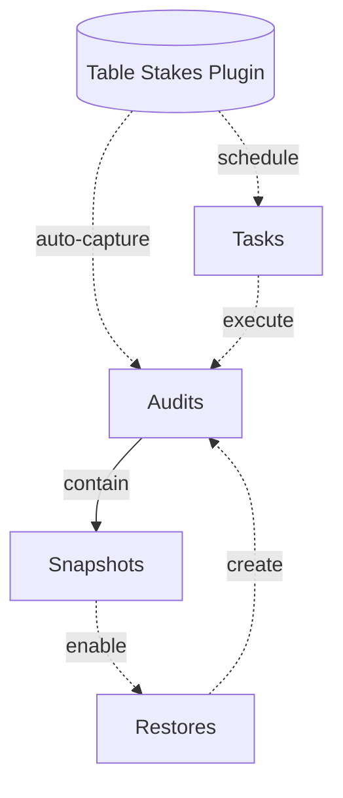

# Strapi Table Stakes

Restore essential CMS features to Strapi v5 Community Edition

## Features

### Audit Logs
Track document operations for accountability and compliance.

### Snapshots
Restore to previous document snapshot.

### Tasks
Schedule publish / unpublish operations on one or more documents.

## Development

### Setup

#### Create Strapi Project

```shell
npx create-strapi@latest my-strapi-project
cd my-strapi-project
```

#### Link Plugin

In the `plugin` directory:
```shell
npx yalc publish
```

In the `strapi` directory:
```shell
npx yalc add strapi-table-stakes
```

#### Start Development

In the `plugin` directory:
```shell
npm run watch:link
```

In the `strapi` directory:
```shell
npm run dev
```

### Overview


