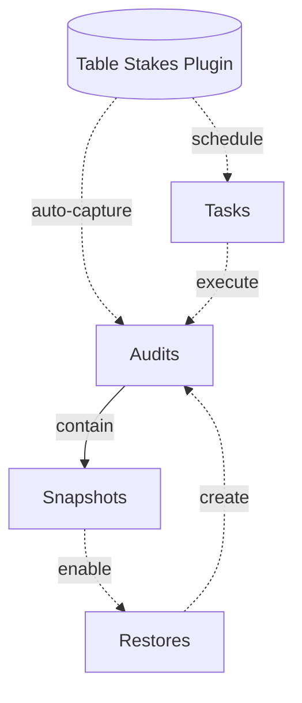

# Strapi Table Stakes

Provide essential CMS features to Strapi v5 Community Edition

This is a proof-of-concept plugin, use this at your own risk.

## Features

### Audits
Automatically track document operations for compliance and accountability.

### Snapshots
Restore a document to a previous version.

### Tasks
Schedule publish and unpublish operations on one or more documents.

## Development

### Setup

#### Create Strapi Project

```shell
npx create-strapi@latest my-strapi-project
cd my-strapi-project
```

#### Link Plugin

In the `plugin` directory:
```shell
npx yalc publish
```

In the `strapi` directory:
```shell
npx yalc add strapi-table-stakes
```

#### Start Development

In the `plugin` directory:
```shell
npm run watch:link
```

In the `strapi` directory:
```shell
npm run dev
```

### Overview


